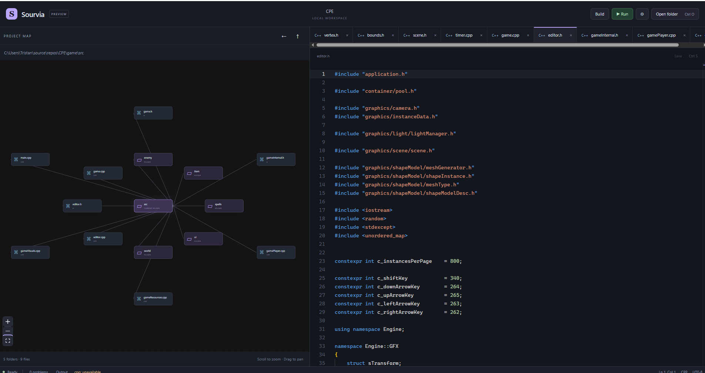

# Sourvia

Ein kleiner Electron-Editor für Windows und Linux. Das Projekt wird als lokale
Mindmap navigiert: Der aktuelle Ordner liegt im Zentrum, seine direkten Dateien
und Unterordner liegen darum herum. Monaco übernimmt den Texteditor.



## Starten

Voraussetzung: Node.js **22.12 oder neuer** und npm. Linux benötigt eine grafische
Desktop-Sitzung und die üblichen Electron-Systembibliotheken (GTK, NSS, ALSA).

```sh
npm install
npm run dev
```

React-Änderungen werden im Entwicklungsmodus automatisch aktualisiert.
Nach Änderungen an Main oder Preload den Entwicklungsprozess neu starten.

Produktionsbuild und Start (der Build wird automatisch vor dem Start erstellt):

```sh
npm start
```

Falls PowerShell die Ausführung von `npm.ps1` blockiert, die Befehle mit
`npm.cmd` ausführen, zum Beispiel `npm.cmd install` und `npm.cmd start`.

Electron und Monaco werden lokal installiert; der Editor benötigt zur Laufzeit
keinen CDN-Zugriff. Der MVP enthält noch keinen Installer.

## Bedienung

1. **Open folder** wählen und einen Projektordner auswählen.
2. Ordner im Graphen anklicken, um sie zum Mittelpunkt zu machen.
3. Dateien anklicken, bearbeiten und mit **Ctrl+S** speichern.
4. Mausrad zum Zoomen und freie Fläche zum Verschieben des Graphen verwenden.

| Tastenkürzel | Aktion |
| --- | --- |
| Ctrl+O | Projektordner öffnen |
| Ctrl+S | Aktive Datei speichern |
| Ctrl+W | Aktiven Tab schließen |
| Ctrl+Tab / Ctrl+Shift+Tab | Nächster / vorheriger Tab |
| Alt+Left | Vorheriger Ordner |
| Alt+Up | Übergeordneter Ordner innerhalb des Projekts |
| F5 | Alle offenen Dateien speichern, bauen und Programm starten |
| Ctrl+Shift+B | Alle offenen Dateien speichern und bauen |
| Shift+F5 | Laufenden Build oder Programm stoppen |
| Ctrl+Klick / F12 | Zur Definition im Projekt springen |
| Ctrl+Space | Code-Vorschläge anzeigen |
| F8 / Shift+F8 | Nächstes / vorheriges Problem in Monaco |

Tabs behalten Text, Undo-Historie und Scrollposition. Ungespeicherte Änderungen
sind mit einem Punkt markiert. Tab- und Projektwechsel fragen nach Speichern,
Verwerfen oder Abbrechen. Beim Beenden kann man abbrechen und zunächst speichern.
Extern veränderte Dateien werden beim Speichern nicht still überschrieben.

Unterstützt werden UTF-8-Textdateien bis 8 MiB. Binärdateien und UTF-16 werden
abgewiesen. Symlinks werden im Graphen ausgelassen. Dateizugriffe bleiben auf den
ausgewählten Projektordner beschränkt. Ignorierte Namen stehen zentral in
`src/main/filesystem.ts` (`ignoredNames`). Kein Dateiwatcher: Einen Ordner erneut
besuchen, um externe Änderungen der Verzeichnisstruktur einzulesen.

## Build & Run

Oben stehen **Build**, **Run** und die Einstellungen über **⚙** bereit.
Bei **Visual Studio 2022 + MSBuild** kann **Program executable** leer bleiben:
Run baut zuerst und ermittelt dann das Startprogramm aus der generierten Solution.
Dabei wird Premakes Startprojektreihenfolge berücksichtigt; Bibliotheksprojekte
werden übersprungen. Sourvia liest den zur gewählten Konfiguration gehörenden
Programmpfad mit MSBuild 17.8 oder neuer aus. Das Arbeitsverzeichnis kommt aus
den Projekteinstellungen, andernfalls wird der Programmordner verwendet.
Ein leeres Arbeitsverzeichnis beziehungsweise `.` aktiviert bei automatischer
Programmerkennung dieses Verhalten; andere Verzeichnisse überschreiben es.

Bei Make oder für einen manuellen Startpfad **Program executable** eintragen, beispielsweise
`bin/Debug/MyApp.exe` unter Windows oder `bin/Debug/MyApp` unter Linux.
Die Einstellungen werden lokal pro Projekt gespeichert. Build funktioniert
auch ohne konfiguriertes Programm.

- **Make** führt Make im eingestellten **Makefile directory** aus.
- **Premake** führt zuerst den ausgewählten Generator aus und anschließend
  das passende Build-Werkzeug. Ein `premake5.lua` im Projektstamm wählt diesen
  Modus vor. Mit `gmake` wird `premake5 --file=<Skript> gmake` und danach Make ausgeführt.
  Der Generator `gmake2` ist für ältere Premake-Versionen auswählbar.
  Siehe [Premake: Verwendung](https://premake.github.io/docs/Using-Premake/).
- Unter Windows wird bei einem `vcpkg.json` **Visual Studio 2022 + MSBuild**
  vorausgewählt. Sourvia generiert mit `vs2022` und baut die Solution mit MSBuild,
  sodass die projektseitige [vcpkg-Integration](https://learn.microsoft.com/en-us/vcpkg/users/buildsystems/msbuild-integration/)
  Includes und Bibliotheken wie GLFW einbindet. Die frühere erzwungene
  `gmake`-Vorgabe wird beim Laden alter Einstellungen für diese Projekte einmalig
  korrigiert. Später ausdrücklich gespeicherte Generatoren bleiben erhalten.
  MSBuild wird über Visual Studios `vswhere` gefunden; erforderlich sind
  Visual Studio 2022 beziehungsweise Build Tools mit den C++-Werkzeugen.
  **MSBuild executable** oder `SOURVIA_MSBUILD` können den Pfad vorgeben.
  Die Solution wird im Build-Verzeichnis erkannt, wenn genau eine `.sln`
  vorhanden ist; andernfalls **Visual Studio solution** eintragen.
  Konfiguration und Plattform sind standardmäßig `Debug` und `x64`.
- **Configuration** wird als `config=<Wert>` übergeben, etwa `debug` oder
  `release`. Bei MSBuild wird sie als `/p:Configuration=<Wert>` übergeben.
  **Make target** beziehungsweise **MSBuild target** ist optional; leer bedeutet Standardziel.
- Skript, Makefile-Ordner, Programm und dessen Arbeitsordner werden relativ
  zum Projektstamm aufgelöst und müssen innerhalb des Projekts liegen.
  Wenn Premake `location "build"` verwendet, **Makefile directory** auf `build`
  setzen. Das Verzeichnis darf beim Generieren neu entstehen.
- Make und Premake können über ihre Programmnamen auf PATH oder einen
  ausführbaren Dateipfad eingestellt werden, ohne zusätzliche Anführungszeichen
  oder Argumente. Alternativ setzen `SOURVIA_MAKE` und `SOURVIA_PREMAKE` die
  Vorgaben. Eine vorhandene `scripts/premake5.exe` (Linux: `scripts/premake5`)
  wird als lokale Premake-Vorgabe erkannt. Unter Windows wird `mingw32-make` verwendet, wenn es auf PATH liegt
  und `make` fehlt. Der Compiler muss separat installiert sein.
- Programmargumente stehen einzeln pro Zeile; Leerzeichen innerhalb einer Zeile
  gehören zum Argument. **Program working directory** ist unabhängig vom
  Build-Verzeichnis. Die Ausgabe unterstützt aktuell keine interaktive Eingabe.

Ein fehlgeschlagener Build startet das Programm nicht. **Stop** beendet den
laufenden Prozess einschließlich seiner Kindprozesse; auch Projektwechsel und
Beenden räumen laufende Builds auf. Gespeicherte Projektdateien werden erst nach
einem ausdrücklichen Build/Run ausgeführt.

**Output** zeigt Build- und Programmausgaben einschließlich Exit-Code; der letzte
Teil bis 256.000 Zeichen bleibt sichtbar. GCC-/Clang- und MSVC-Fehlermeldungen
erscheinen zusätzlich als Markierungen und in **Problems**. Ein Klick auf einen
Eintrag öffnet die entsprechende Stelle. Compilerdiagnosen beziehen sich auf
den letzten Build und werden beim nächsten Build ersetzt; Language-Server-
Diagnosen werden während des Bearbeitens aktualisiert.

## Language Server

Die Server werden separat installiert und bei der ersten passenden Datei
automatisch gestartet. Fehlt ein Server, bleiben Navigation und Bearbeitung
verfügbar; die Statusleiste zeigt `unavailable`, der Tooltip die Ursache.
Nach einer Installation oder einem Serverfehler den Projektordner erneut öffnen.

| Dateien | Programm auf PATH | Optionaler Pfad über Umgebungsvariable |
| --- | --- | --- |
| `.c`, `.cpp`, `.cc`, `.cxx`, `.h`, `.hpp`, `.hxx` | `clangd` | `SOURVIA_CLANGD` |
| `.hlsl`, `.hlsli` | `shader-language-server` | `SOURVIA_HLSL_SERVER` |

Die Variablen enthalten den Pfad zur ausführbaren Datei, ohne eingebettete
Argumente oder zusätzliche Anführungszeichen. Weitere Server und Argumente können
in `src/main/languageServer/config.ts` ergänzt werden. Der HLSL-Server wird mit
`--stdio --hlsl` gestartet; für andere Distributionen dort die Argumente anpassen.

[clangd](https://clangd.llvm.org/installation) verwendet eine vorhandene
`compile_commands.json` in übergeordneten Ordnern beziehungsweise `build/`.
Bei CMake lässt sie sich mit `-DCMAKE_EXPORT_COMPILE_COMMANDS=ON` zusammen mit
Ninja oder Unix Makefiles erzeugen. Abweichende Build-Verzeichnisse können über
die [clangd-Konfiguration](https://clangd.llvm.org/config.html) angegeben werden.
Der Graph ignoriert `build/`; clangd kann die Compilation Database trotzdem lesen.

Als HLSL-Server eignet sich der
[shader-language-server aus shader-sense](https://github.com/antaalt/shader-sense).
HLSL erhält eine eigene Monaco-Sprach-ID und verwendet Monacos mitgelieferten
C++-Lexer für die grundlegende C-artige Syntax. Semantische Diagnostics liefert
der externe Server; Sourvia implementiert keine eigene Shaderanalyse.

Implementiert: stdin/stdout mit UTF-8-Content-Length-Framing, Initialize-Lifecycle,
DidOpen/DidChange/DidSave/DidClose, volle und inkrementelle Synchronisierung,
Diagnostics als Monaco-Marker sowie Shutdown mit Zeitlimit und Prozessabbruch.
Zusätzlich: Hover mit Typinformationen/Dokumentation, Definition per
**Ctrl+Klick** oder **F12** (auch in noch nicht geöffneten Projektdateien) und
LSP-Autovervollständigung mit **Ctrl+Space** sowie nach `.`, `->` und `::`.
Sprünge bleiben auf Dateien im geöffneten Projekt beschränkt.
Diese Funktionen benötigen den passenden Language Server; für C/C++ ist das
clangd. Ohne Server stehen weiterhin Build-Ausgabe und Compilerdiagnosen bereit.
Die Compilation Database sollte dieselben Includes und Defines wie der
Make-/Premake-Build enthalten, damit clangd den Code korrekt analysieren kann.

## Prüfen

```sh
npm run typecheck
npm test
npm run build
npm run test:electron
```

Der Electron-Smoke-Test startet ein verborgenes echtes Fenster, verwendet einen
temporären Projektordner und prüft Graphnavigation, Monaco, Tabwechsel, Bearbeiten,
Speichern, Schutz ungespeicherter Änderungen, LSP-Marker, F12/Strg-Klick, Hover,
Completion, Run-Einstellungen, Speichern vor Run und Fehlernavigation. Die
Build-Tests prüfen mit separaten Testprozessen Generierung, Reihenfolge,
Argumente, Fehlerabbruch und Stop. Der Protokollserver
in `tests/fixtures` ist ausschließlich ein Testwerkzeug, kein Ersatzserver der App.
Auf einem Linux-CI ohne Display kann `xvfb-run -a npm run test:electron` verwendet
werden. Echte clangd-Diagnostics lassen sich optional mit `npm run test:clangd`
prüfen; dafür muss clangd installiert oder `SOURVIA_CLANGD` gesetzt sein.
`npm run test:make` prüft einen echten Make-/GCC-Build mit Programmstart sowie
einem anschließenden Compilerfehler. Dafür müssen Make (unter Windows auch
`mingw32-make`) und `gcc` installiert sein; `SOURVIA_MAKE` kann Make vorgeben.

## Struktur

- `src/main/filesystem.ts`: Projektgrenzen, Verzeichnislesen, Lesen/Speichern.
- `src/main/main.ts`, `preload.ts`: Fenster, Dialoge und begrenzte IPC-API.
- `src/main/languageServer/`: generischer LSP-Transport und Prozessverwaltung.
- `src/main/build/`: Make-/Premake-Ablauf, Prozessabbruch und Compilerdiagnosen.
- `src/renderer/components/`: Graph, Tabs und Monaco-Anbindung.
- `src/renderer/editor/`: Dokumentzustand und Monaco-Konfiguration.
- `src/shared/`: gemeinsame Typen und Dateiendungen.

Der Renderer läuft mit Context Isolation und Sandbox, ohne Node Integration.
IPC prüft den aufrufenden Frame. Neue Fenster, externe Navigation und
Berechtigungsanfragen sind deaktiviert. Serverbefehle kommen aus der Anwendung
oder der Startumgebung, niemals aus geöffneten Projektdateien.

Technische Grundlagen:
[Electron-Sandbox](https://www.electronjs.org/docs/latest/tutorial/sandbox),
[React Flow](https://reactflow.dev/api-reference/react-flow),
[Language Server Protocol](https://microsoft.github.io/language-server-protocol/specifications/lsp/3.17/specification/).
